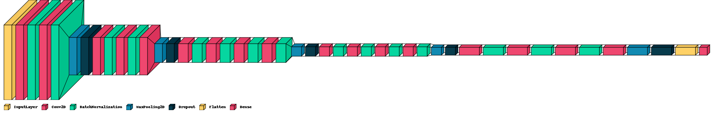

# Facial Emotion Recognition
A small CNN model based on VGGNet to recognize facial emotion realtime, the model can run without support from GPU with approximately 14 - 16 fps.

### Overview
Facial emotion plays an important role in communication to present the all the meanings, attitudes want to transmit. Besides, facial emotion recognition is also bring other interesting benefits so it becomes getting more and more attention nowadays. Therefore, we propose a small CNN model can run on devices with or without GPU.
Our model got **89.09%** accuracy on train data and **71.4%** accuracy on test data.

### Dataset
Here we use Facial Emotion Recognition 2013 (FER2013), AffectNet Sample we found on Kaggle and The Extended Cohn-Kanade (CK+) to train our model.
You can download these datasets here:
 - **FER-2013**: https://www.kaggle.com/datasets/msambare/fer2013
 - **AffectNet Sample**: https://www.kaggle.com/datasets/mouadriali/affectnetsample?select=train_class
 - **CK+**: https://www.kaggle.com/datasets/shawon10/ckplus

###  5-block VGG-style model
You can see the model's architecture in image below:
:------------------------------------------------------:

### Loss and accuracy of model on test data
To install the required packages, run `pip install -r requirements.txt`.

### Demo in realtime
You can go to `Demo/` and run:
 - HaarCascade: `python Face_Detector_HaarCascade.py`
 - ResNet SSD: `python Face_Detector_SSD.py`

Or you also can run it in google colab or jupyter notebook to compare 2 ways detection: `Demo_Haar_Vs_SSD.ipynb`

